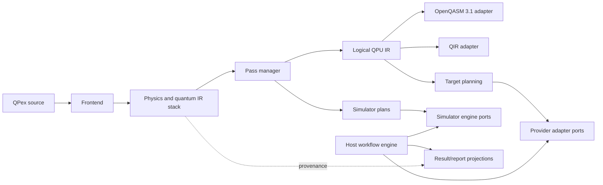

# QPex v1 compiler blueprint

## Status and scope

Proposed Architecture Path blueprint for ADR 0106 and WP-0025.

This document designs the compiler that can realize the v1 north-star
language. It does not authorize a rewrite, dependency adoption, provider SDK,
or implementation phase.

## 1. Current implementation baseline

The shipping Python compiler is not a disposable prototype. It already
contains:

- lexer, parser, AST, module linking, visibility, and type checking;
- early-collapse, nested-control, physical-axiom, and unitarity checks;
- joint-amplitude and mixed-state runtimes;
- finite binder and second-quantized lowering;
- symbolic/provenance and provider-neutral QPU projections;
- OpenQASM generation;
- scientific scope, input, workflow, observation, resource, Job, and QPU
  submission contracts.

The main architectural limitation is not missing files. It is that newer
features were added as neighboring projections from a mutable AST rather than
as a single typed, invariant-checked multi-level compiler pipeline.

The production architecture therefore reuses the accepted semantics and
conformance evidence while replacing ad-hoc projection boundaries
incrementally.

### 1.1 Repository gap assessment

The audit classified the important remaining gaps rather than treating every
missing behavior as a new design problem.

#### Documentation state defects

- the normative v0.1 header references ADRs only through ADR 0069 although
  accepted language/compiler decisions now extend through ADR 0105;
- the v0.1 text still describes Parametric/Dynamic lanes as proposed and
  outside conformance after their boundary slices were reviewed;
- `qpex-language-axioms.md` still rejects `return`, while ADR 0068 and the
  normative specification require explicit terminal `return` in ordinary
  functions;
- architecture status prose contains historical phase descriptions that no
  longer match Issue/ADR completion records.

LISS-0068 owns reconciliation. This broad design task does not silently edit
the old normative meaning.

#### Genuine language-design gaps

- arbitrary named Bra/Ket notation and one canonical mathematical spelling;
- qutrit/qudit local dimensions;
- linear quantum usage, no-cloning/no-discard, and safe uncomputation;
- body-level Theory/Experiment/Workflow/Execution phase typing;
- an executable dynamic controller type for mid-circuit feed-forward;
- general continuous equation syntax and numerical lowering;
- general mixed-state/channel/POVM acting spaces;
- a coherent v1 standard library and authoring/tooling model.

#### Compiler-architecture gaps

- no lossless CST/formatter/migration layer;
- newer domains are projected independently from AST rather than flowing
  through one typed HIR/Physics/Quantum/Plan stack;
- provenance is present but not enforced by a common pass invariant;
- no exact-versus-approximate pass manager;
- physical layout/routing/scheduling and QIR lowering are not complete;
- QASM user-function execution remains honest rejection rather than correct
  inlining/lowering.

#### Execution/product gaps

- no selected live provider adapter or credential technology;
- no complete Job/Session/Batch implementation against a live QPU;
- no general simulator-engine portfolio behind one capability port;
- real scientific datasets are bound at a Host contract boundary, but broader
  schemas/adapters and end-to-end reports remain future work;
- the capstone suite does not yet prove every proposed v1 profile.

## 2. Container view



Clean Architecture ownership:

- language semantics and IR invariants are Domain;
- compile, plan, simulate, submit, and report orchestration are Use Cases;
- source, settings, RNG, simulator, artifact, target profile, Job, result, and
  diagnostic sinks are Ports;
- filesystem, CLI, OpenQASM text, QIR/LLVM, simulator libraries, and provider
  SDKs are Adapters.

No adapter defines a physical law, type conversion, approximation default, or
error policy.

## 3. Frontend

### 3.1 Source pipeline

```text
bytes
  -> UTF-8 validation
  -> NFC normalization and confusable analysis
  -> tokens with exact source spans
  -> lossless CST
  -> desugared AST
  -> module graph
  -> phase-resolved HIR
```

Why both CST and AST:

- CST supports formatting, migration, comments, documentation, and precise
  fix-its;
- AST contains one semantic form for Unicode Dirac notation, pipelines,
  binders, and declarations;
- source migration can be verified without coupling the formatter to semantic
  lowering.

### 3.2 Domain-specific AST families

The AST should distinguish only constructs whose semantics differ:

```text
Decl
  Package | Import | Theory | Experiment | Workflow | Execution | Report
  System | Class | Struct | Enum | Interface | Impl | Function
  Discretization | Equation | Observable | Parameter | Input

Expr
  State | Dirac | Algebra | Binder | Call | Pipe | Evolve | Match
  OperatorRef | Tensor | Tuple | Literal | Variable

Stmt
  Bind | Return | TerminalMeasure | Inspect | Snapshot
  DynamicMeasure | DynamicMatch | Apply
```

Important normalizations:

- `|ψ⟩`, `⟨φ|A|ψ⟩`, `A†`, and `ψ ⊗ φ` become typed algebra nodes;
- `lhs |> f(a)` becomes `Call(f, [lhs, a])` while retaining pipeline
  provenance;
- multi-variable binders become nested binder nodes with explicit source
  binder order;
- numeric separators and Unicode input details disappear after lexical
  provenance is recorded;
- no OpenQASM, LLVM, provider, simulator, or file-format node enters AST.

### 3.3 Name, phase, and module resolution

Resolution runs over the merged module graph:

1. package/import and visibility resolution;
2. declaration collection and forward-reference resolution;
3. phase dependency graph construction;
4. interface implementation coherence;
5. system/register identity and tensor-order resolution;
6. binder/domain symbol resolution;
7. effect and capability name resolution.

The resolver rejects cycles and illegal direction before expression type
checking. This prevents an Execution symbol from being treated as a missing
Theory variable and producing a misleading type error.

### 3.4 Type and physical-law checking

The frontend owns:

- carrier and `State`/`DensityState` kind checking;
- Hilbert acting-space compatibility;
- dimensional algebra and unit conversion contracts;
- finite-domain and index proofs;
- fermion/boson/spin statistics;
- channel/POVM domain compatibility;
- linear/affine usage of quantum values;
- no-cloning and no-implicit-discard rules;
- effect propagation;
- Static/Dynamic/Host phase restrictions;
- terminal measurement;
- parameter-shape independence;
- target-independent resource lower bounds.

Numerical positivity or completeness that cannot be proven symbolically is
emitted as a checked construction guard in a simulator/Host plan. It is not
silently assumed.

## 4. Multi-level intermediate representation

### 4.1 HIR — phase-resolved source meaning

HIR contains:

- resolved symbols and generic/interface bindings;
- declaration phase;
- typed source expressions;
- explicit effects and capabilities;
- exact source and desugaring provenance.

HIR remains close enough to source for diagnostics.

### 4.2 Physics IR — equations and operator algebra

Physics IR preserves:

- Hilbert spaces and tensor factors;
- Kets, Bras, operators, observables, channels, and POVMs;
- symbolic coefficients, units, and dimensions;
- mathematical binders and constraints;
- continuous domains and equations;
- particle statistics and second-quantized order;
- symmetry declarations and conservation laws;
- initial conditions and measurement intent.

This is the optimization level for algebraic simplification, unit checking,
commutators, symmetry reasoning, and discretization selection. It must not be
prematurely expanded to gates.

### 4.3 Quantum Semantic IR — executable finite semantics

After explicit discretization/mapping, Quantum Semantic IR contains:

- finite acting spaces;
- pure/mixed state transformations;
- unitary, isometry, channel, and measurement regions;
- static and dynamic control regions;
- linear resource use and ancilla lifetime;
- parameter symbols;
- exact versus approximate operation markers.

This level is backend-neutral and can drive both simulator plans and algorithm
planning.

### 4.4 Algorithm Plan IR — explicit realization choices

Algorithm Plan IR records decisions such as:

- Jordan-Wigner, Bravyi-Kitaev, tapering, or another encoding;
- product-formula order, steps, term order, or tolerance derivation;
- QFT form, arithmetic construction, block encoding, or qubitization;
- measurement grouping and shot allocation;
- state-preparation algorithm;
- discretization basis and numerical integrator;
- simulator method;
- declared error and resource budgets.

Every decision has a provenance record and an error category:

```text
Exact | ProvenBound(value) | EmpiricalEstimate(value) | Unbounded
```

### 4.5 Logical QPU IR

Logical QPU IR contains:

- immutable instructions and structured control regions;
- logical register identity and local/flat indices;
- symbolic parameters;
- terminal and dynamic measurements;
- required target capabilities;
- ancilla and lifetime information;
- approximation and source provenance;
- resource estimates.

It does not contain provider SDK objects, credentials, queue state, or
physical qubit identifiers.

### 4.6 Target IR

Target planning adds:

- physical layout;
- native instruction set;
- routing operations;
- calibrated durations;
- schedule and synchronization;
- target capability snapshot;
- post-routing resource estimate.

Target IR may be emitted as OpenQASM, QIR, a simulator execution plan, or an
adapter-owned artifact. It is never accepted as a new source semantics.

### 4.7 Host Workflow IR

Host Workflow IR is separate:

```text
ScientificInput
  -> ExperimentInstance
  -> WorkflowPlan
  -> JobRequest / SessionPlan / BatchPlan
  -> JobResult
  -> WorkflowReport
```

It references immutable executable artifacts and parameter bindings. It does
not mutate Quantum Semantic IR or expose a backend SDK to source code.

## 5. Pass manager and proof obligations

Each pass declares:

- accepted input IR version;
- preconditions;
- output invariants;
- whether it is exact or approximate;
- resources introduced or removed;
- provenance transform;
- diagnostics;
- deterministic pass identity/configuration.

Pass output is rejected if its invariant verifier fails.

Recommended pass groups:

### 5.1 Source and semantic passes

- canonical desugaring;
- phase and effect resolution;
- type/dimension/acting-space inference;
- linear-use and uncomputation analysis;
- constant/meta evaluation;
- binder-domain proof;
- equation and algebra normalization.

### 5.2 Physics-to-finite passes

- explicit discretization;
- basis transformation;
- second-quantized mapping;
- symmetry reduction;
- operator canonicalization;
- channel/POVM validation;
- approximation ledger construction.

### 5.3 Algorithm planning

- Hamiltonian simulation strategy;
- state preparation;
- arithmetic synthesis;
- QFT/phase-estimation planning;
- variational circuit and gradient planning;
- measurement grouping;
- shot and confidence allocation.

Planning uses declared policies and target-independent estimates. If more than
one plan is legal, the selected cost model and candidate comparison are
preserved.

### 5.4 Circuit optimization

Before physical mapping:

- inverse cancellation;
- rotation merging;
- identity and dead-region elimination;
- commutation-aware reordering only when proven or explicitly permitted;
- controlled/adjoint specialization;
- ancilla reuse after proven uncomputation;
- unitary synthesis;
- circuit cutting only when explicitly requested as an approximation.

### 5.5 Target planning

The target pass pipeline follows the established separation visible in modern
transpilers:

1. target-independent decomposition;
2. initial layout;
3. connectivity routing;
4. native-gate translation;
5. target-aware optimization;
6. timing/scheduling;
7. final capability and budget validation.

Physical routing is never performed in Theory or logical QPU IR.

### 5.6 Noise and mitigation

These are separate concerns:

- a physical noise model in Theory is part of the simulated system;
- a measured device-noise profile belongs to Execution/Target data;
- noise-aware routing changes target planning;
- mitigation such as readout correction, ZNE, or PEC changes sampling and
  estimator semantics and is an explicit execution transform.

Mitigation output includes raw and mitigated estimates, uncertainty, sampling
overhead, calibration identity, and method provenance.

## 6. Backend architecture

### 6.1 Simulator port

```text
SimulatorPort
  capabilities() -> SimulatorProfile
  validate(plan, budget) -> ValidationReport
  execute(plan, inputs, observation_plan) -> SimulationResult
```

Initial engine families:

- exact state vector;
- stabilizer/tableau;
- tensor network and MPS;
- density matrix;
- quantum trajectories;
- Lindblad/ODE integrators;
- future analog/continuous and photonic/qudit engines.

Engine selection is a Host policy based on capabilities and declared
approximation, not a source rewrite.

### 6.2 OpenQASM 3.1 adapter

Responsibilities:

- lower static and supported dynamic regions;
- preserve parameter, measurement, timing, and calibration references;
- emit a declared OpenQASM version and capability manifest;
- reject unsupported source capabilities explicitly;
- map diagnostics back through logical QPU IR provenance.

OpenQASM is allowed to contain richer classical control than a target can
execute. Therefore successful text emission and target acceptance are separate
checks.

### 6.3 QIR adapter

Responsibilities:

- lower logical QPU IR to LLVM/QIR calls and control flow;
- select a named QIR profile;
- preserve entry-point, output, resource, and required-capability metadata;
- use runtime interfaces rather than provider SDK calls;
- validate generated LLVM/QIR with standard tooling.

Base and adaptive/dynamic profiles must not be conflated. Profile selection is
an explicit execution/technology decision.

### 6.4 Provider adapters

Provider adapters implement:

- target discovery and capability snapshots;
- authentication through secret ports;
- artifact submission;
- Job lifecycle, retry, cancellation, session, and batch behavior;
- raw-result retrieval;
- conversion to provider-neutral `JobResult`.

They do not:

- parse QPex source;
- choose scientific approximations;
- repair invalid artifacts;
- redefine measurement or partial-result semantics;
- inject credentials into compiler IR.

## 7. Provenance and reproducibility

Every compiled artifact has an immutable manifest:

```text
source hash and package graph
language/spec version
compiler and pass versions
input data identities and units
parameter bindings
all mappings and approximations
error/resource budgets
target capability snapshot
logical-to-physical mapping
emitted artifact hash
Job attempts and provider IDs
measurement plan and shot allocation
raw and transformed result identities
```

The manifest is machine-readable and reportable. It is not hidden in logs.

## 8. Debug and inspection architecture

Three distinct mechanisms prevent accidental collapse:

1. compiler inspection: view HIR/Physics/Plan/QPU IR and pass diffs;
2. simulator checkpoints: non-collapsing snapshots with explicit resource
   cost;
3. hardware diagnostics: additional declared jobs, tomography, calibration,
   or target-supported dynamic measurements.

A QPU backend cannot implement a simulator checkpoint by inserting an
unrequested measurement.

## 9. Diagnostics architecture

Diagnostics use stable typed records:

```text
code
severity
phase
primary span
related spans
physical invariant
expected and actual type/space/unit/capability
provenance chain
safe fix-it, if unique
```

No catch-all fallback converts a lowering failure to an empty circuit,
one-qubit acting space, default grid, truncated expansion, or successful
warning.

## 10. Implementation strategy

### 10.1 Conformance before rewrite

1. Rebaseline the normative spec and diagnostics.
2. Build formula-to-source and source-to-observable golden scenarios.
3. Add serialized test fixtures only for stable public artifacts, not private
   internal Python dictionaries.
4. Treat the Python Kernel as reference behavior.
5. Implement the new typed IR pipeline incrementally.
6. Start a Rust implementation only behind differential conformance tests.

### 10.2 Rust and MLIR boundary

The repository already selects Rust as the long-term implementation language.
The remaining technology decision is narrower:

- custom Rust HIR/Physics/Quantum IR for source fidelity and low dependency
  risk;
- optional MLIR dialects for reusable transformation infrastructure;
- LLVM/QIR only near the backend.

The recommended default is custom typed high-level IR in Rust plus explicit
adapters to MLIR/QIR where they provide proven value. Physics semantics should
not depend on an external compiler framework's release cycle.

### 10.3 No big-bang replacement

Migration completes only when:

- every v1 valid/invalid scenario has deterministic evidence;
- Python and Rust agree on observable semantics and diagnostics where both
  claim support;
- examples identify executable profiles honestly;
- generated OpenQASM/QIR validates independently;
- the Host result path is exercised against at least one simulator and one
  provider adapter without importing provider logic into the compiler core.

## 11. Principal risks

| Risk | Mitigation |
|---|---|
| Unicode notation harms tooling | lossless CST, formatter, migrator, UAX #31/NFC policy, editor input |
| IR stack becomes ceremonial | each level must own a distinct invariant and at least one required pass |
| automatic uncomputation changes meaning | proof obligation; otherwise explicit diagnostic |
| dynamic control leaks classical runtime | phase-local `Controller<T>` and capability-checked finite control |
| optimizer changes physics | exact/approximate pass classification and provenance verifier |
| provider feature drift | versioned capability snapshots and adapter contract tests |
| rewrite creates two languages | shared conformance suite and Python reference until parity |
| real-world data corrupts reproducibility | typed input schemas, units, hashes, and immutable provenance |

## 12. Architecture verification targets

- round-trip source formatting preserves AST and comments;
- every AST construct maps to exactly one HIR semantics;
- every lowering node has source/provenance ancestry;
- exact passes preserve semantic equivalence on reference simulators;
- approximate passes satisfy their declared bound/estimate contract;
- unsupported target capabilities fail before submission;
- generated OpenQASM and QIR pass independent validators;
- no provider SDK import exists in Domain/compiler-core packages;
- no unrequested measurement appears in any target artifact;
- differential Python/Rust conformance remains green during migration.
